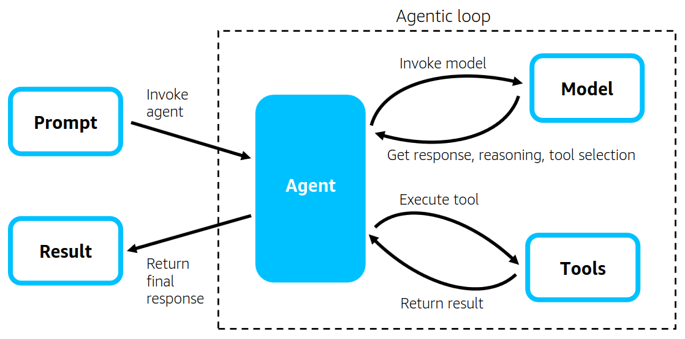

# Strands in 5 minutes  

5分钟上手strands系列 - 通过Strands SDK创建您的第一个AI Agent

## 核心概念



- **模型（Model）**
  - 作为代理的推理引擎，支持Amazon Bedrock、Anthropic Claude、Meta Llama等主流模型
  - 通过LiteLLM兼容OpenAI、Mistral等第三方API
  - 示例模型配置：
    ```
    from strands.models import BedrockModel
    model = BedrockModel(model_id="us.amazon.nova-micro-v1:0", region_name='us-east-1')
    ```

- **工具（Tools）**
  - 预置20+工具（计算器、HTTP请求、mem0等）
  - 使用`@tool`装饰器快速集成自定义函数：
    ```
    from strands import tool
    @tool
    def file_analyzer(path: str) -> dict:
        """文件分析工具"""
        # 实现文件解析逻辑
        return analysis_result
    ```

- **提示词（Prompt）**
  - 系统提示定义代理行为准则：
    ```
    SYSTEM_PROMPT = """你是一个数据分析专家，使用工具处理数据并生成可视化报告：
    1. 优先使用pandas进行数据清洗
    2. 使用matplotlib创建交互式图表
    3. 输出Markdown格式报告"""
    ```


## 1. 准备工作

- **安装 Python 3.10 或更高版本**
- **拥有 AWS 账户,并在Amazon Bedrock 中启用 Claude 3.7 模型访问权限**


## 2. 环境搭建
### 2.1 Python环境配置

# 创建并激活 Python 虚拟环境
```bash
python -m venv venv
source .venv/bin/activate  # Linux/Mac
venv\Scripts\activate     # Windows
```
# 安装必要的包
```bash
pip install strands
pip install strands-agents strands-agents-tools
```
如果使用uv管理
```bash
uv pip install strands
uv pip install strands-agents strands-agents-tools
```

### 2.2 环境变量配置
1. 创建`.env`文件并添加以下内容：
```
AWS_ACCESS_KEY_ID=你的访问密钥ID
AWS_SECRET_ACCESS_KEY=你的秘密访问密钥
AWS_DEFAULT_REGION=你的默认区域（如us-east-1）
```

2. AWS CLI配置（可选）：
```bash
aws configure
# 按提示输入Access Key ID和Secret Access Key
# 设置默认区域（如us-east-1）
```

3. 验证AWS配置：
```bash
aws sts get-caller-identity
```
如果配置正确，将显示你的AWS账户信息。


## 3. 创建你的第一个 Agent

创建一个专注于计算机科学教育的“Subject Expert” Agent，创建一个文件 `subject_expert.py`，并填入以下代码：

```python
from strands import Agent

# 打开debug日志（可选）
import logging
logging.getLogger("strands").setLevel(logging.DEBUG)
logging.basicConfig(
    format="%(levelname)s | %(name)s | %(message)s",
    handlers=[logging.StreamHandler()]
)

# 创建Agent实例
agent = Agent(
    system_prompt = """
你是一个计算机科学教育专家，擅长用简单易懂的语言和实用例子解释计算机科学概念。
当用户提问时，请给出清晰、准确的回答，并尽量用代码或生活实例帮助理解。
"""
)

# 调用Agent
question = "请解释什么是递归，并给出一个Python例子。"
agent(question)  # Agent会自动打印响应
```
保存文件并运行即可看到你的第一个 AI Agent 生效。


## 4. 进阶：交互式会话

如果你希望与 Agent 进行持续的对话，可以修改脚本如下：

```python
from strands import Agent

agent = Agent(
    system_prompt = """
你是一个计算机科学教育专家，擅长用简单易懂的语言和实用例子解释计算机科学概念。
当用户提问时，请给出清晰、准确的回答，并尽量用代码或生活实例帮助理解。
"""
)

def interactive_session():
    print("计算机学科专家 (输入 'exit' to 退出)")
    print("-----------------------------------------------------------")
    
    while True:
        # Get user input
        user_input = input("\n你的问题是: ")
        
        if user_input.lower() in ["exit", "quit", "bye"]:
            print("Goodbye!")
            break
        
        # Send the input to the agent, which will automatically print the response
        print("\nThinking...\n")
        agent(user_input)

if __name__ == "__main__":
    interactive_session()
```

运行后可与 Agent 进行多轮对话。


## 5. 注意事项

- **模型访问权限**：如果遇到权限错误，请确认 AWS 凭证和 Bedrock 模型访问权限已正确配置。
- **跨区域推理**：建议在多个 AWS 区域（如 us-east-1, us-east-2, us-west-2）启用 Claude 模型访问，以降低延迟。
- **调试与日志**：Strands Agents SDK 支持详细的调试日志，便于排查问题。


## 6. 总结

- **入门门槛低**：只需几行代码即可创建功能强大的 Agent。
- **系统提示很关键**：通过提示词定义 Agent 的行为和专长。
- **SDK 自动处理复杂逻辑**：如认证、请求格式化、模型管理等。


这样，你就成功创建了第一个基于 Strands Agents SDK 和 Amazon Bedrock 的 AI Agent！


pip install strands-agents strands-agents-tools)